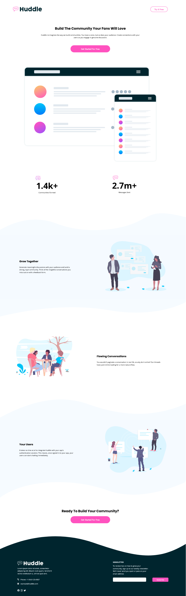

# Frontend Mentor - Huddle landing page with curved sections solution

This is a solution to the [Huddle landing page with curved sections challenge on Frontend Mentor](https://www.frontendmentor.io/challenges/huddle-landing-page-with-curved-sections-5ca5ecd01e82137ec91a50f2).

## Table of contents

- [Overview](#overview)
  - [The challenge](#the-challenge)
  - [Screenshot](#screenshot)
  - [Links](#links)
- [My process](#my-process)
  - [Built with](#built-with)
  - [Useful resources](#useful-resources)
- [Author](#author)

## Overview

### The challenge

Users should be able to:

- View the optimal layout for the site depending on their device's screen size
- See hover states for all interactive elements on the page

### Screenshot

### Links

- Solution URL: [click here](https://github.com/climaco-sarmiento/huddle-landing-page-challenge)
- Live Site URL: [click here](https://climaco-sarmiento.github.io/huddle-landing-page-challenge/)

## My process

### Built with

- Semantic HTML5 markup
- CSS custom properties
- Flexbox
- Mobile-first workflow

### Useful resources

- [Utility for coloring of SVG icons](https://codepen.io/jumarjuaton/full/mdJYWYq) - Quite helpful in color manipulations of SVGs.

## Author

- Website - [Ubaid Khalid](https://www.ubaidkhalid.dev)
- LinkedIn - [Ubaid Khalid](https://www.linkedin.com/in/ubaid-khalid-dev/)
